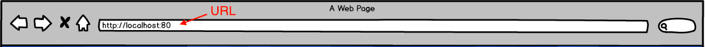

# Introduction

  

  
  
  
  

## What is CFET WidgetUI ?

> CFET WidgetUI is a **front-end component framework software** of CFET; is also a ``website``.

Unlike other monolithic frameworks and Websites, CFET WidgetUI allows three application roles to use it, namely ``Core Developer``, ``App Developer`` and ``User``.

* For Core Developer: **You are required to master how to control your Equipment with CFET.** And know how to access the resource. You can also develop a new Widget in code.

* For App Developer: You just be asked to focus on how to access the resource with ``URI``(All the resource and function in CFET can be accessed with URI which also means Route). **All the URI you need will be listed on the back end console from the Core Developer.** 
And more importantly, you should learn how to ``build and save user interfaces`` through the operation on the website.

  

* For User: **The only thing you have to do is open Chrome, and enter the URL(that App Developer told you) to visit the website.**  Then you can monitor and operate all the things you need in the control system.

---

## Getting Started

>The main difference between Core Developer and App Developer is whether the back-end control program is written by yourself. For CFET WidgetUI, unless the former wants to program, the difference between the two roles is not significant. ``It is assumed that everyone already knows what kind of URL there is and knows its corresponding meaning.``

*I will introduce the homepage and the usage of each Widget. Different Widgets will be written into corresponding documents separately. Only the basic usage of the homepage will be introduced here.*

- [x] ``Get in WidgetUI Website``

   The front-end website is mounted on CFET, after running the CFET APP, you will see a console like this.

   

   It will tell you which port CFET WidgetUI is running on, copy this url and visit it with a browser, you can get the website directly.

- [x] ``basic usage of the homepage``

   The leftmost side of the navigation bar is ADD Widget. You can select and click the required Widget, the Widget will appear on the web page.

  

  Click on the Widget layout button to enter the edit mode, in this mode there will be a gray frame around Widge.

  

  You can drag, move, zoom in and out, configure the style and composition of the user interface. When you finish the configuration, click on the blank area of the page to launch the edit mode.

  **Then you can click the save button to save the configured interface.**

  The interface will be saved as a json file, you can choose to save it in the specified path of your computer or in the CFET APP.

  > ``save it in the specified path of your computer：``
   
   Click the load button on the right side of the navigation bar and select the corresponding json file to get the user interface

  > ``save it in the CFET APP:``
   
   Mount Customview Thing under the execution folder of CFET APP, then save and configure the json file. When running CFET APP again, the user can get the corresponding user interface through url+interface name, like http://localhost:8002/userInterface1
  
---

## Wigets
* [Status](./src/components/Status/README/Status.pdf)
* [Config](./src/components/Config/README/Config.md)
* [Navigation](./src/components/Navigation/README/Navigation.md)
* [Method](./src/components/Method/README/Method.md)
* [Broadcast](./src/components/Broadcast/README/Broadcast.md)